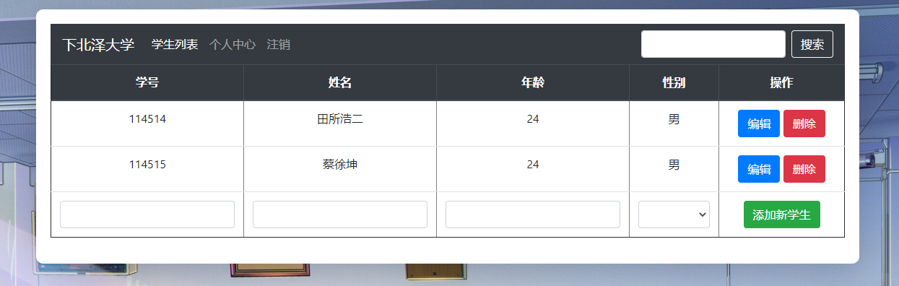

# PHP 学生管理系统 BY Pink Champange17

一个使用 PHP 实现，功能简单的学生管理系统，刚好够应付课堂作业用。

## 项目来源

地址:https://github.com/PinkChampagne17/Student-Management-PHP

背景图片来源：https://www.pixiv.net/artworks/59440693

PS:因为深夜work并且My Homie已经眠了所以我直接上传的项目而不是Fork一个因为我的Fork好像有什么问题无法Upload Files。

## 项目截图预览



.png)


## 实现功能

- 登录
- 注册
- 修改用户名
- 修改密码
- 使用 cookie 保持登录状态
- 使用管理员与学生分开权限

## 管理员功能

- 对学生信息的增删查改
- 对成绩信息的增删查改
- 对班级信息的增删查改

## 学生功能

- 查询自己的班级信息
- 查询自己的成绩信息
- 查询自己的基本信息

## 技术栈

- PHP
- Bootstrap v4
- MariaDB（与 MySQL 兼容）

## 测试环境

- WampServer Version 3.2.0 64bit
- PHP 5.6.40 for CLI (Command-Line Interface)
- MariaDB 10.4.10

## 数据库创建语句

```SQL
create database student_management;
use student_management;

CREATE TABLE `manager` (
  `id` int(11) NOT NULL AUTO_INCREMENT,
  `uname` varchar(20) NOT NULL,
  `pwd` varchar(50) NOT NULL,
  PRIMARY KEY (`id`),
  UNIQUE KEY `id` (`id`)
) default charset=utf8;

CREATE TABLE `studentaccount` (
  `id` int(11) NOT NULL AUTO_INCREMENT,
  `uname` varchar(20) CHARACTER SET utf8 NOT NULL,
  `pwd` varchar(50) CHARACTER SET utf8 NOT NULL,
  PRIMARY KEY (`id`)
)default charset=utf8;


CREATE TABLE `classinfo` (
  `id` int(20) NOT NULL AUTO_INCREMENT,
  `sid` int(20) NOT NULL,
  `name` varchar(20) CHARACTER SET utf8 NOT NULL,
  `sc` varchar(20) CHARACTER SET utf8 NOT NULL,
  `Class` varchar(40) CHARACTER SET utf8 NOT NULL,
  `uid` int(11) NOT NULL,
  PRIMARY KEY (`id`)
) default charset=utf8;

CREATE TABLE `scoreinfo` (
  `id` int(20) NOT NULL AUTO_INCREMENT,
  `sid` int(20) NOT NULL,
  `name` varchar(20) CHARACTER SET utf8 NOT NULL,
  `sub` varchar(20) CHARACTER SET utf8 DEFAULT '',
  `score` int(20) DEFAULT NULL,
  `uid` int(20) DEFAULT NULL,
  PRIMARY KEY (`id`)
)default charset=utf8;

CREATE TABLE `studentinfo` (
  `id` int(11) NOT NULL AUTO_INCREMENT,
  `sid` int(11) NOT NULL,
  `name` varchar(15) NOT NULL,
  `age` int(11) NOT NULL,
  `sex` enum('男','女','其他') NOT NULL,
  `uid` int(11) NOT NULL,
  PRIMARY KEY (`id`),
  KEY `uid` (`uid`)
)default charset=utf8;
```

## 可以改善的地方

- SQL 语句的生成是通过简单粗暴地拼接字符串完成的，最开始是为了方便应付作业的人能够快速上手并完成。正确的做法是对 SQL 语句进行预处理，否则会导致 SQL 注入攻击。

## 鸣谢
- My Homie:Pink Champange17

## 米米想说的话
- 天马行空的实现方式
- 复制粘贴高级工程师
- 一个优秀的摸鱼伙伴

